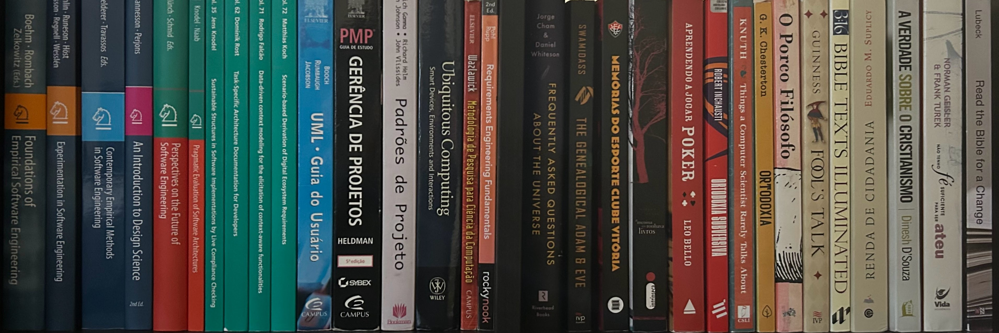

---
#
# By default, content added below the "---" mark will appear in the home page
# between the top bar and the list of recent posts.
# To change the home page layout, edit the _layouts/home.html file.
# See: https://jekyllrb.com/docs/themes/#overriding-theme-defaults
#
layout: home
title: About me
---

# Researcher on Software Engineering at Fraunhofer IESE, Lecturer of Software Architecture at Mannheim University of Applied Sciences

I am a computer scientist who worked in industry for 15 years as a project manager, project leader, and software engineer, with experience in many domains but particularly in mobile telecommunications (Operation Support Systems and Business Support Systems). I began researching context awareness in 2012, and in 2015, I started my PhD on the topic. I completed my PhD in 2022 at the University of Kaiserslautern (Germany). My thesis, titled "Data-driven Context Modeling for the Elicitation of Context-aware Functionalities," is available for download [here](https://publica.fraunhofer.de/bitstreams/7593ac9b-ade9-4871-8ac1-718995669a45/download).

I am currently a researcher, senior software architect, and project manager at the [Fraunhofer Institute for Experimental Software Engineering (IESE)](https://www.iese.fraunhofer.de/) (Germany) and a lecturer of Software Architecture at [Mannheim University of Applied Sciences](https://www.hs-mannheim.de/).

## Research interests

- Empirical software engineering
- Context awareness
- Data-driven context modeling
- Generative AI for software architecture
- Interoperability
- Privacy-enhancing technologies
