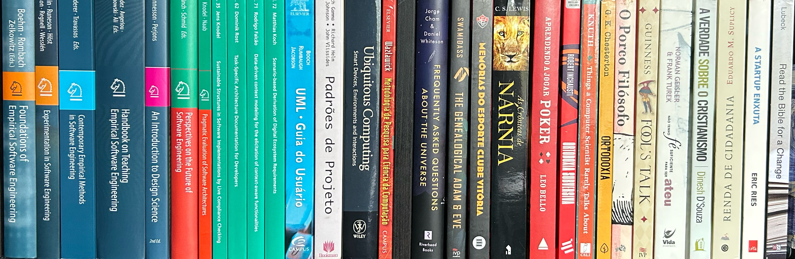

---
#
# By default, content added below the "---" mark will appear in the home page
# between the top bar and the list of recent posts.
# To change the home page layout, edit the _layouts/home.html file.
# See: https://jekyllrb.com/docs/themes/#overriding-theme-defaults
#
layout: home
title: About me
---

# Researcher on Software Engineering at Fraunhofer IESE, Lecturer of Software Architecture at Mannheim Technical University of Applied Sciences

I am a computer scientist who worked in industry for 15 years as a project manager, project leader, and software engineer, with experience in many domains but particularly in mobile telecommunications (Operation Support Systems and Business Support Systems). I began researching context awareness in 2012, and in 2015, I started my PhD on the topic. I completed my PhD in 2022 at the University of Kaiserslautern (Germany). My thesis, titled "Data-driven Context Modeling for the Elicitation of Context-aware Functionalities," is available for download [here](https://publica.fraunhofer.de/bitstreams/7593ac9b-ade9-4871-8ac1-718995669a45/download).

I have contributed as a reviewer/PC member in journals, conferences, and workshops, including JSS, SQJ, JSME, ICSA, REFSQ, RCIS, CIbSE, SBSC, and CREARE. I am one of the co-organizers of [SAGAI](https://www.iese.fraunhofer.de/en/events/sagai.html).

I am currently a researcher, senior software architect, and project manager at the [Fraunhofer Institute for Experimental Software Engineering (IESE)](https://www.iese.fraunhofer.de/) (Germany), where I lead the topic **Generative AI and Sofware Architecture**. Besides that, I lecture Software Architecture at [Mannheim Technical University of Applied Sciences](https://www.hs-mannheim.de/).

## News
- **ASPIRING'25:** I am contributing to the Program Committee of the [2nd International Usable Security and Privacy for Emerging Technologies Workshop](https://aspiring-workshop.github.io/).
- **XX SBSC:** I am contributing to the Program Committee of the [XX Simpósio Brasileiro de Sistemas Colaborativos](https://sbsc.sbc.org.br/2025/index.php/desenho-de-pesquisa/) (tracks "Desenho de Pesquisa" and "Reflexões e Provocações").
- **CREARE'25:** I am contributing to the Program Committee of [CREARE'25](https://creare.iese.de/).
- **RCIS'25:** I am contributing to the Program Committee of [RCIS'25](https://www.rcis-conf.com/rcis2025/).
- **SAGAI'25:** I am co-organizing [SAGAI'25, the 1st International Workshop on Software Architecture and Generative AI](https://www.iese.fraunhofer.de/en/events/sagai.html), to be held together with ICSA'25 in Odense (Denmark).
- **ICSA'25:** I am contributing to the Program Committee of [ICSA'25](https://conf.researchr.org/home/icsa-2025) (track "Software Architecture in Practice").
- **InfoDays 2024 Modernes API:** In September 2024, I talked in Cologne (Germany) about the potential for using generative AI to implement generic APIs. The slides can be found [here](202409266_Falcao_InfoDays-2024.pdf).

## Research interests

- Empirical software engineering
- Generative AI and software architecture
- Context awareness
- Data-driven context modeling
- Interoperability
- Privacy-enhancing technologies
