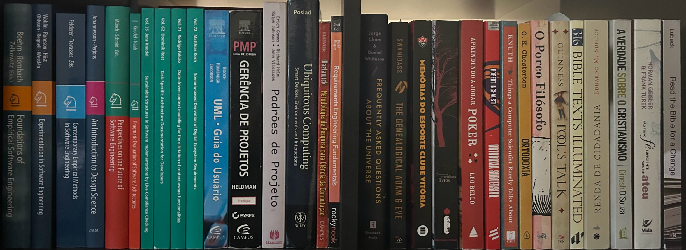

---
#
# By default, content added below the "---" mark will appear in the home page
# between the top bar and the list of recent posts.
# To change the home page layout, edit the _layouts/home.html file.
# See: https://jekyllrb.com/docs/themes/#overriding-theme-defaults
#
layout: home
title: About me
---

# Researcher on Software Engineering at Fraunhofer IESE, Lecturer of Software Architecture at Mannheim University of Applied Sciences

I am a software engineer who worked in industry for 15 years as a project manager, project leader, systems analyst, and programmer, with experience in many domains but particularly in mobile telecommunications (Operation Support Systems and Business Support Systems). In 2012, I started to do research on context awareness, and in 2015 I started my PhD on the topic, completed in 2022 at the University of Kaiserslautern (Germany).

Currently I am researcher, senior software architect and project manager at the Fraunhofer Institute for Experimental Software Engineering IESE (Germany) and lecturer of Software Architecture at Mannheim University of Applied Sciences.
