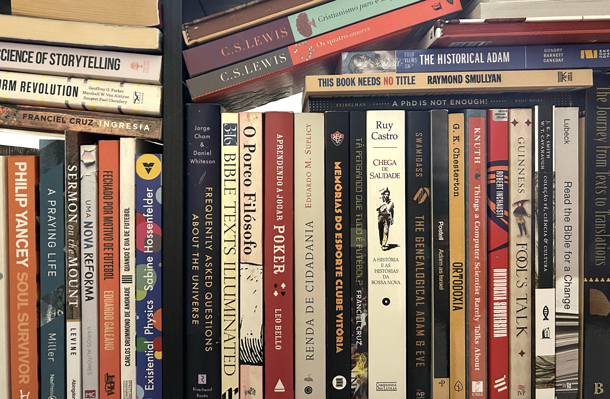

---
#
# By default, content added below the "---" mark will appear in the home page
# between the top bar and the list of recent posts.
# To change the home page layout, edit the _layouts/home.html file.
# See: https://jekyllrb.com/docs/themes/#overriding-theme-defaults
#
# Beyond CS
#
layout: page
title: Beyond CS
---

* TOC
{:toc}

# Has computer science chosen me?

For a long time, I have asked myself whether I chose computer science or computer science "chose" me. My father is a computer scientist, and my two older brothers are computer scientists. My sister isn't, but her husband is. An older cousin is also a computer scientist.

When I finished high school and was about to apply for what would be the university where I did my bachelor's, my father called me to a walk. He planned to give me advice about what profession I should choose. Without naming any concrete course of study, he emphasized the importance of applying for a course that had something to do with my natural abilities. I should pay attention to what I am good at and what brings me joy. A few days later, I filled out my application to the computer science course at the Federal University of Bahia. A couple of days later, my father asked me what course I applied for. As I responded, his reaction was:

> _My son, you didn't understand a single word of what I said._

More than 25 years later, we still laugh when we remember that talk. Of course, he wanted my best. But the fact is that I have been blessed to have found professional realization in computer science. As I say to him:

> _Dad, I may not have made all my life decisions wisely, but choosing computer science was something I did right._

# "Knopffußball"

I have lived in Germany for more than one decade and have a personal goal of introducing Button Football/Button Soccer (in Portuguese: Futebol de Botão, which I have referred to as "Knopffußball" in German) in the country. It is a simulated soccer game played on a tabletop.

I brought some teams (the "buttons") from Brazil and built a tabletop following some tutorials I found on the Internet. At least three German colleagues enjoyed the game, and with two of them I used to play regularly. I just need to find three more people to ground my _Verein_ ("association"), which already has a name: "Verein für Knopffußball-Organization" The acronym will therefore be "VKO", which in German, just coincidentally, sounds like my last name ("Falcão"). What were the chances!

# Calligraphy work

I am not a calligrapher. But I am confident enough to share some calligraphic work I created to decorate our house. The works were printed on paper of 350 g and size 30x40 cm.

You are welcome to [download](gott-der-hoffnung.pdf), print, and use it if you like ([CC-BY-NC](https://creativecommons.org/licenses/by-nc/4.0/)).

But if you are interested in seeing a collection of works of some of the most talented calligraphers in the world, I recommend [the book 3:16 by Prof. Knuth](https://www-cs-faculty.stanford.edu/~knuth/316.html).

# What am I reading now?

Reading books is one of my favorite things to do. I read less than what I wanted, and my bookshelf always has some unread volumes, as I keep getting books at a higher rate than I can read them.

While my technical readings revolve around empirical software engineering, my recurrent leisure reading topics are biblical/Christian theology and football/soccer (in particular ["crônicas"](https://en.wikipedia.org/wiki/Cr%C3%B4nica)), among others.

As 2026 started busier than expected, I have not found time to resume my regular readings. The only thing I have read regularly currently is the Bible. Talking about it, in 2026 I started using the Portuguese translation "Nova Versão Transformadora" (NVT), which is equivalent to the English translation "New Living Version" (NLV). What a great surprise! After favoring for many years the NIV/NVI (for the writing style) and especially the Geneva Study Bible (for the comments), NVT has given me a fresh perspective on the texts.

# What do I believe in?

I am a believer - what at least may sound odd from a person who does evidence-based research. Faith goes in the opposite direction. Concluding whether God exists or not cannot be drawn from observation. One needs faith to step into this realm and make up their minds about whether they believe God exists or they believe God doesn't exist.

I believe there is a God who is beyond the material world and therefore can only be known as He reveals Himself. And I believe he did it in human history progressively, and ultimately through the person of Jesus. I am convinced that Jesus was who he claimed to be, and this is the cornerstone of my faith.

